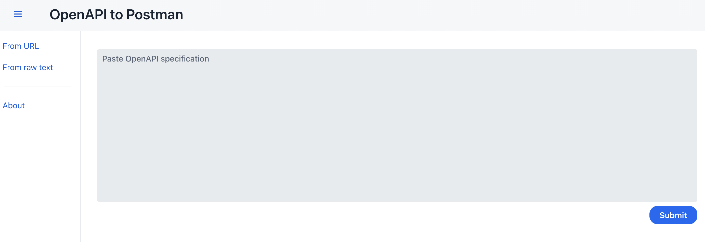

# OpenAPI to Postman

Convert an OpenAPI file into a Postman collection [v2.1](https://schema.postman.com/collection/json/v2.1.0/draft-07/collection.json).

[](https://gitpod.io/#https://github.com/gcatanese/openapi-postman/tree/main)

Web application that generates a Postman collection (in JSON format) from an OpenAPI file. 
You can paste the content of the OpenAPI file or enter the URL.  

Made with ❤️, [OpenAPI Generator](https://github.com/OpenAPITools/openapi-generator) and [Vaadin](https://vaadin.com/).   
    



## Run locally

```
git clone https://github.com/gcatanese/openapi-postman.git
cd openapi-postman
./mvnw spring-boot:run
```

## Why

Importing OpenAPI files is supported by Postman but this is a lot better because:
* convert path variables into Postman variables
* convert placeholders (i.e. `{{MY_VAR}}`) into Postman variables
* create a Postman request for each OpenAPI (request) example: multiple examples generates different requests for the same endpoint
* define the authorisation method (basic auth, API key)
* create a Postman variable for the API key

## Contribute

Try it out and let me know if it works for you. Contributions, questions and feedback are welcome.


